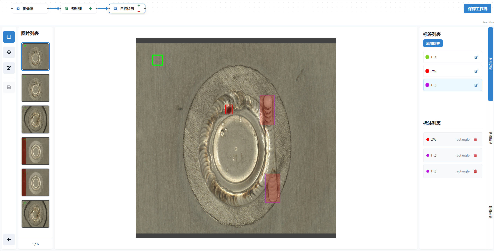

# Nimir

[English](./README_EN.md) | 简体中文

Nimir（Next Integrated Machine Intelligence Resource） 是一个基于 workflow 的标注、训练、推理一体化平台。它提供了直观的用户界面和强大的功能，通过工作流的方式将数据处理全流程有机地串联起来，实现端到端的CV AI 应用开发。

## 界面截图



## 特性

- 🎯 多样化的标注工具
  - 支持矩形框、多边形等多种标注形式
  - 快捷键支持，提高标注效率
  - 实时预览和编辑功能

- 🔄 工作流驱动
  - 灵活的工作流编排能力
    - 支持数据采集、标注、训练、推理、后处理等节点的自由组合
    - 可配置串行、并行或混合执行模式
    - 支持节点间的条件判断和数据流转
  - 丰富的节点类型
    - 数据源节点：支持多种数据获取方式
    - 标注节点：支持多种标注任务类型
    - 模型节点：支持训练和推理
    - 处理节点：支持结果处理和数据转换
  - 可视化的工作流管理
    - 拖拽式节点编排
    - 实时任务状态监控
    - 节点执行结果可视化

- 🚀 一体化解决方案
  - 全流程数据和模型管理
  - 支持多种数据格式导入导出
  - 兼容主流深度学习框架

## 技术栈

### 前端
- Next.js 13 (App Router)
- TypeScript
- Chakra UI
- React Query
- Konva.js

### 后端
- FastAPI
- SQLModel
- PostgreSQL
- Sentry

## 快速开始

### 环境要求
- Node.js 18+
- Python 3.9+
- PostgreSQL
- Redis

### 安装步骤

1. 克隆仓库
   ```bash
   git clone <your-repo-url>
   ```

2. 环境配置
   
   2.1 复制环境配置文件
   ```bash
   cp .env.example .env
   ```
   
   2.2 生成密钥
   ```bash
   python -c "import secrets; print(secrets.token_urlsafe(32))"
   ```
   复制输出的密钥并更新到 .env 文件中

   2.3 启动所需服务
   ```bash
   cd docker
   docker compose --env-file ../.env up -d
   ```

3. 后端设置

   3.1 安装 Python 依赖
   ```bash
   cd backend
   poetry env use 3.9
   poetry install
   ```

   3.2 初始化数据库
   ```bash
   # 等待数据库启动
   python app/backend_pre_start.py

   # 运行数据库迁移
   alembic upgrade head

   # 创建初始数据
   python app/initial_data.py
   ```

   3.3 启动后端服务器
   ```bash
   uvicorn app.main:app --reload --log-level debug
   ```

4. 前端设置

   4.1 安装依赖
   ```bash
   cd frontend
   pnpm install
   ```

   4.2 启动开发服务器
   ```bash
   pnpm dev
   ```
   或构建生产版本：
   ```bash
   pnpm build
   pnpm start
   ```

5. 访问 `http://localhost:3000` 使用应用

## 相关项目

- [Flock](https://github.com/Onelevenvy/flock) - 低代码平台，用于快速构建聊天机器人、RAG应用和muti-agent团队.

## 贡献指南

欢迎提交 Issue 和 Pull Request。

## 许可证
本项目采用 Apache License 2.0 许可证。查看 [LICENSE](./LICENSE) 文件了解更多详细信息。